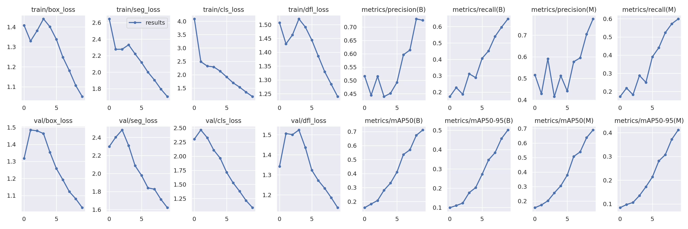

# Underwater Trash Detection with YOLOv8

A Flask web app that takes an uploaded image, runs a fine-tuned YOLOv8 segmentation model on it, and returns the image with labelled bounding boxes. The model was trained to find trash in underwater footage: bags, bottles, cans, nets, rope, wreckage and similar debris. It also recognises marine life and ROVs so they aren't mistaken for trash.

## Model

| | |
|---|---|
| Base model | `yolov8s-seg` (Ultralytics) |
| Dataset | TrashCan underwater trash dataset (Roboflow export, v3) |
| Classes | 22: 16 trash types, 6 non-trash (crab, eel, fish, shells, starfish, other animals, plant, ROV) |
| Training | 10 epochs, batch 8, 640 px, Google Colab |

Validation results after the final epoch:

| Task | Precision | Recall | mAP@50 | mAP@50-95 |
|---|---:|---:|---:|---:|
| Bounding box | 0.725 | 0.647 | 0.712 | 0.502 |
| Segmentation mask | 0.776 | 0.599 | 0.690 | 0.411 |

Ten epochs is a short run. Loss was still falling at the end, so these numbers are a baseline, not a ceiling. Full curves, the confusion matrix and validation predictions are in [`runs/segment/train/`](runs/segment/train).



## Datasets explored

`Code Notebooks/` has the Colab notebooks for four trash datasets I trained on before settling on TrashCan for the app:

- TrashCan (underwater, used in the app)
- Trash-ICRA19 (underwater)
- Drinking Waste (bottles and cans)
- UAVVaste (aerial drone imagery)

## Running it

```bash
git clone https://github.com/visalsattar/yolo_detection_app.git
cd yolo_detection_app
pip install -r requirements.txt
python app.py
```

Then open http://127.0.0.1:5000 and upload an image. Results are saved to `static/predicted/`.

The trained weights are in `models/best.pt` (the final checkpoint from the 10-epoch run).

## Limitations

- The app draws bounding boxes only. The model also predicts segmentation masks, but the app doesn't render them yet.
- Upload filenames are sanitised and limited to image types, and debug mode is off unless `FLASK_DEBUG=1` is set. It still uses Flask's development server, so it isn't meant for public deployment.
- The model was trained on underwater images, so expect weak results on photos of trash on land.

## Stack

Python · Ultralytics YOLOv8 · PyTorch · OpenCV · Flask
